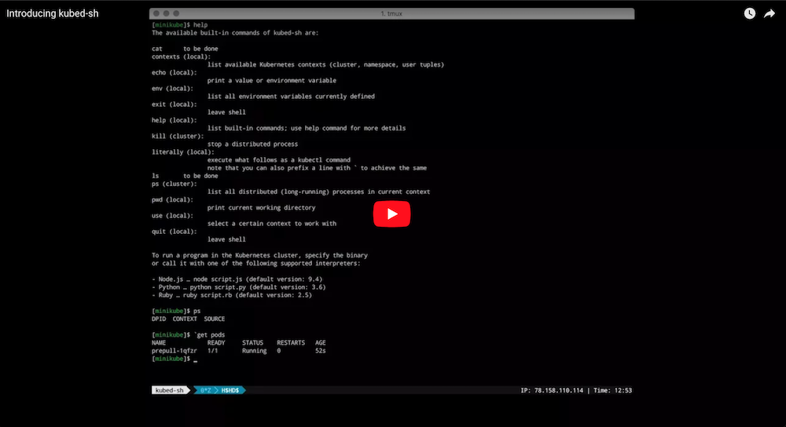
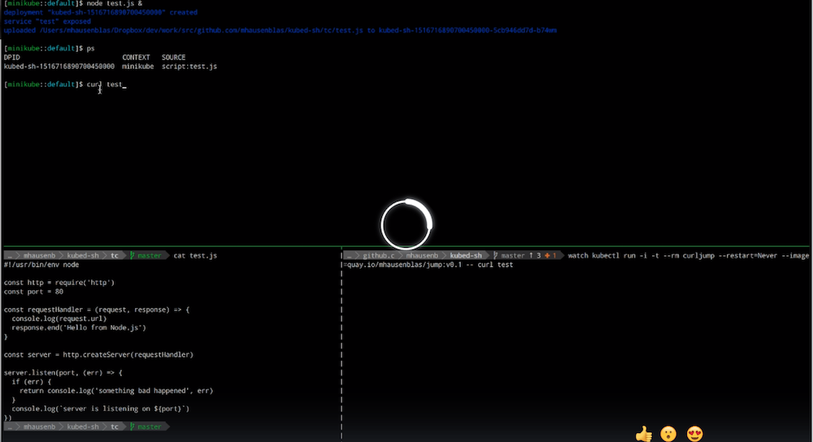

# kubed-sh

[](https://github.com/mhausenblas/kubed-sh/releases/)
[](https://github.com/mhausenblas/kubed-sh/issues)
[](https://goreportcard.com/report/github.com/mhausenblas/kubed-sh)

Welcome to `kubed-sh`, the Kubernetes distributed shell for the casual cluster user. In a nutshell, `kubed-sh` lets you execute a program in a Kubernetes cluster without having to create a container image or learn new concepts. For example, let's say you have a Node.js script called [test.js](https://github.com/mhausenblas/kubed-sh/blob/master/tc/test.js) and you want to launch it as a containerized app in your Kubernetes cluster, here's what you'd need to do in `kubed-sh`:

```
[minikube::default]$ node test.js &
[minikube::default]$ ps
DPID                          SOURCE      URL
kubed-sh-1517679562543558000  test.js     test
```

Looks familiar to what you do in your local shell? That's the point of `kubed-sh` :)


- [Use cases](#use-cases)
- [Installation](#install-it)
  - [Download binaries](#download-binaries)
  - [Build from source](#build-from-source)
- [Usage](#use-it)
  - [Built-in commands](#built-in-commands)
  - [Modes](#modes)
  - [Environments](#environments)
  - [Configuration](#configuration)
- [FAQ](#faq)

See it in action, below or try it out in your browser using this [Katacoda scenario](https://katacoda.com/mhausenblas/scenarios/kubed-sh_101):

| [](https://www.youtube.com/watch?v=gqi1-XLiq-o) | [](https://www.useloom.com/share/441a97fd48ae46da8d786194f93968f6) |
|:--------------------------------:|:------------------------------------------:|
| *Introducing kubed-sh (5 min)*   | *kubed-sh hot-reload feature demo (3 min)* |

In addition to launching (Linux ELF) binaries directly, the following interpreted environments are currently supported:

- When you enter `node script.js`, a Node.js (default version: 12) environment is provided and `script.js` is executed.
- When you enter `python script.py`, a Python (default version: 3.6) environment is provided and the `script.py` is executed.
- When you enter `ruby script.rb`, a Ruby (default version: 2.5) environment is provided and the `script.rb` is executed.

Note that `kubed-sh` is a proper shell environment. This means you can expect features such as auto-complete of built-in commands, history operations (`CTRL+R`), or clearing the screen (`CTRL+L`) to work as per usual.

## Use cases

If you have access to a [Kubernetes](https://kubernetes.io/) cluster and you have [kubectl](https://kubernetes.io/docs/tasks/tools/install-kubectl/) installed, you're good to go. You might want to consider using `kubed-sh`, for example for:

- **Prototyping**—Let's say you quickly want to try out a Python script or, in the context of microservices, see how a Go program and a Node.js script play together.
- **Developing**—Imagine you're developing a program in Ruby and want to launch it in a Kubernetes cluster, without having to build an image and pushing it to a registry. In this case, the experimental hot-reload feature (using `HOTRELOAD=true`) is useful for you. Whenever you save the file locally, it gets updated in the Kubernetes cluster, if hot-reload is enabled.
- **Learning Kubernetes**—You're new to Kubernetes and want to learn how to interact with it? Tip: if you issue the `debug` command you can see which `kubectl` commands `kubed-sh` launches in the background.

Also, you may be interested in [my motivation](why.md) for writing `kubed-sh`?

## Install it

No matter if you're using the [binaries below](#download-binaries) or if you [build it from source](#build-from-source),
the following two prerequisites must be met:

1. `kubectl` must be [installed](https://kubernetes.io/docs/tasks/tools/install-kubectl/), tested with client version `1.9.1` so far.
1. Access to a Kubernetes cluster must be configured (tested with 1.7 and 1.8 clusters so far). To verify this, you can use the following two steps:
  - if you do `ls ~/.kube/config > /dev/null && echo $?` and you see a `0` as a result, you're good, and further
  - if you do `kubectl config get-contexts | wc -l` and see a number greater than `0`, then that's super dope.

### Download binaries

Currently, only binaries for [Linux](https://github.com/mhausenblas/kubed-sh/releases/download/0.5.1/kubed-sh-linux) and
[macOS](https://github.com/mhausenblas/kubed-sh/releases/download/0.5.1/kubed-sh-macos) are provided. Do the following to install `kubed-sh` on your machine.

For Linux:

```
$ curl -s -L https://github.com/mhausenblas/kubed-sh/releases/download/0.5.1/kubed-sh-linux -o kubed-sh
$ chmod +x kubed-sh
$ sudo mv kubed-sh /usr/local/bin
```

For macOS:

```
$ curl -s -L https://github.com/mhausenblas/kubed-sh/releases/download/0.5.1/kubed-sh-macos -o kubed-sh
$ chmod +x kubed-sh
$ sudo mv kubed-sh /usr/local/bin
```

### Build from source

You need [Go](https://golang.org/dl/) in order to build `kubed-sh`. I'm using `go1.9.2 darwin/amd64` on my machine. To build `kubed-sh` from source, do the following:

```
$ go get github.com/mhausenblas/kubed-sh
```

Note that if your `$GOPATH/bin` is in your `$PATH` then now you can use `kubed-sh` from everywhere. If not, you can:

- Do a `cd $GOPATH/src/github.com/mhausenblas/kubed-sh` followed by a `go build` and use it from this directory.
- Run it like so: `$GOPATH/bin/kubed-sh`

## Use it

Once you've `kubed-sh` installed, launch it and you should find yourself in an interactive shell:

```
$ kubed-sh
Note: It seems you're running kubed-sh in a non-Linux environment (detected: darwin),
so make sure the binaries you launch are Linux binaries in ELF format.

Detected Kubernetes client in version v1.9.1 and server in version v1.8.0

[minikube::default]$
```

Above, you notice that on start-up `kubed-sh` will tell you which client and server version of Kubernetes it has detected and at any point in time you are able to tell in which context (`minikube` here) and namespace (`default` here) you're operating.

### Built-in commands

Supported built-in commands (see also `help`) are as follows:

```
cat (local):
                        output content of file to terminal
cd (local):
                        change working directory
curl (cluster):
                        execute a curl operation in the cluster
contexts (local):
                        list available Kubernetes contexts (cluster, namespace, user tuples)
echo (local):
                        print a value or environment variable
env (local):
                        list all environment variables currently defined
exit (local):
                        leave shell
help (local):
                        list built-in commands; use help command for more details
kill (cluster):
                        stop a distributed process
literally (local):
                        execute what follows as a kubectl command
                        note that you can also prefix a line with ` to achieve the same
ls (local):
                        lists content of directory
ps (cluster):
                        list all distributed (long-running) processes in current context
pwd (local):
                        print current working directory
sleep (local):
                        sleep for specified time interval (NOP)
use (local):
                        select a certain context to work with
```

### Modes

You can use `kubed-sh` either interactively or in script mode. In script mode, you provide `kubed-sh` a script file to interpret or make it executable (for example using `chmod 755 thescript` along with a [hashbang](https://en.wikipedia.org/wiki/Shebang_(Unix)) header). The following example illustrates using `kubed-sh` in script mode:

Imagine you have a script file called `test.kbdsh` with the following content:

```
#!/usr/bin/env kubed-sh
use minikube
# This line is a comment that will be ignored
node ../thescript.js &
ps
```

Then, you can make it executable and execute it like so:

```
$ chmod 755 test.kbdsh
$ ./test.kbdsh
```

Alternatively you can provide a script via `stdin`:

```
$ cat tc/script.kbdsh | kubed-sh
```

… or as a command line argument:

```
$ kubed-sh tc/script.kbdsh
```

Note that all three ways shown above are equivalent.


### Environments

`kubed-sh` supports environments and within it variables—akin to what your local shell (bash, zsh, fish) does. There are some pre-defined environment variables which influence the creation of the cluster processes you create by either specifying a binary or interpreter and script:

- `BINARY_IMAGE` (default: `alpine:3.7`) … used for executing binaries
- `NODE_IMAGE` (default: `node:12-alpine`) … used for executing Node.js scripts
- `PYTHON_IMAGE` (default: `python:3.6-alpine3.7`) … used for executing Python scripts
- `RUBY_IMAGE` (default: `ruby:2.5-alpine3.7`) … used for executing Ruby scripts
- `SERVICE_PORT` (default: `80`) … used to expose long-running processes within the cluster
- `SERVICE_NAME` (default: `""`) … used to overwrite the URL for long-running processes within the cluster
- `HOTRELOAD` (default: `false`) … used for enabling a watch on local files to trigger automatic updates on modification (EXPERIMENTAL)

>**TIP**

> You can overwrite at any time any of the above environment variables to change the runtime behaviour of the cluster processes you create. All changes are valid for the runtime of `kubed-sh`. That is, when you quit `kubed-sh` all pre-defined environment variables are reset to their default values.

Useful for scripting and advanced users: with the 0.5 release there are now four sub-commands to `env` (which itself simply lists the defined variables):

- `env list` … list all defined environments in current context
- `env create ENVNAME` … create a new environment called `ENVNAME`
- `env select ENVNAME` … make environment called `ENVNAME` the active one
- `env delete ENVNAME` … delete environment called `ENVNAME`

If no environment is selected, you are operating in the global environment.
See also the [design](http://kubed.sh/design) as well as [Issue #6](https://github.com/mhausenblas/kubed-sh/issues/6) for what environments are and how to work with them. Note that when you do an `env delete ENVNAME`, this environment is reaped and goes back into the global.

### Configuration

The following environment variables, defined in the parent shell (such as bash), influence the runtime behavior of `kubed-sh`. On start-up, `kubed-sh` evaluates these environment variables and enables or changes its behavior:

| env var             | default | set for |
| -------------------:| ------- | ------- |
| `KUBEDSH_DEBUG`     | `false` | print detailed messages for debug purposes |
| `KUBEDSH_NOPREPULL` | `false` | disable image pre-pull |
| `KUBECTL_BINARY`    | `which kubectl` is used to determine the binary | if set, rather than using auto-discovery, use this binary for `kubectl` commands |

>**TIP**

> If you are in an environment (such as OpenShift Online) where you can't create a DaemonSet, launch `kubed-sh` like so: `$ KUBEDSH_NOPREPULL=true kubed-sh`

> If you want to use the OpenShift CLI tool [oc](https://docs.openshift.org/latest/cli_reference/get_started_cli.html) launch it with `KUBECTL_BINARY=$(which oc) kubed-sh`

## FAQ

**Q**: For whom is `kubed-sh`? When to use it? <br>
**A**: I suppose it's mainly useful in a prototyping, development, or testing phase,
although for low-level interactions you might find it handy in prod environments as well since
it provides an interactive, context-aware version of `kubectl`. See also [use cases](#use-cases).

**Q**: How is `kubed-sh` pronounced? <br>
**A**: Glad you asked. Well, I pronounce it /ku:bˈdæʃ/ as in 'kube dash' ;)

**Q**: Why another Kubernetes shell? There are already some, such as [cloudnativelabs/kube-shell](https://github.com/cloudnativelabs/kube-shell),
[errordeveloper/kubeplay](https://github.com/errordeveloper/kubeplay), and [c-bata/kube-prompt](https://github.com/c-bata/kube-prompt). <br>
**A**: True, there is previous art, though these shells more or less aim at making `kubectl` interactive, exposing the commands such as `get` or `apply` to the user.
In a sense `kubed-sh` is more like [technosophos/kubeshell](https://github.com/technosophos/kubeshell), trying to provide an environment a typical *nix user is comfortable with.
For example, rather than providing a `create` or `apply` command to run a program, the user would simply enter the name of the executable, as she would do, for example, in the bash shell. See also the [motivation](why.md).

**Q**: How does this actually work? <br>
**A**: Good question. Essentially a glorified `kubectl` wrapper on steroids. See also the [design](design.md).
